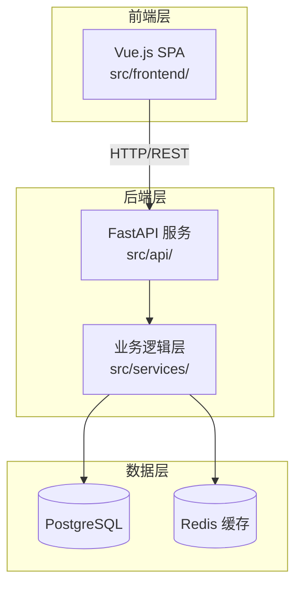
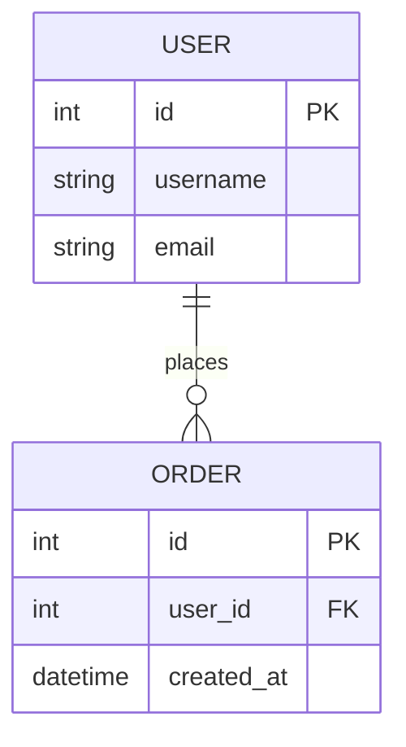
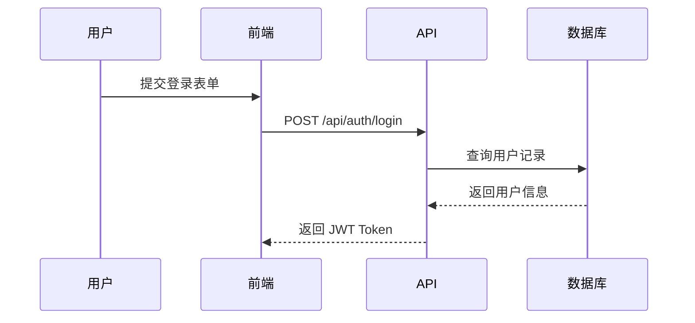

# Thesis Doc Agent — 毕业论文软件工程文档生成技能

## 技能概述

本技能帮助 code agent（如 Claude、antigravity 等）系统性地读取项目代码与对话历史，自动剖析软件工程各维度，并生成可直接用于毕业论文的专业文档。

**核心原则：**
1. **代码溯源强制要求** — 凡涉及具体代码内容，必须标注完整文件路径与说明
2. **论文适配性** — 语言严谨、逻辑清晰，符合学术写作规范
3. **全面性** — 不遗漏任何可挖掘的软件工程信息
4. **可视化优先** — 优先使用图表（Mermaid/表格）辅助说明复杂结构

---

## 第一步：信息采集与分析

在生成任何文档之前，先完成以下侦察工作：

### 1.1 代码结构侦察
```bash
# 获取项目目录树（排除无关目录）
find . -type f \( -name "*.py" -o -name "*.js" -o -name "*.ts" -o -name "*.java" -o -name "*.go" -o -name "*.vue" -o -name "*.jsx" \) \
  | grep -v node_modules | grep -v __pycache__ | grep -v ".git" \
  | sort > /tmp/project_files.txt

# 统计各语言文件数量
cat /tmp/project_files.txt | sed 's/.*\.//' | sort | uniq -c | sort -rn
```

### 1.2 对话历史提取
从对话中提取以下信息，建立"需求备忘录"：
- 用户**明确提出**的功能需求
- 用户**隐含期望**的行为（从反馈和修改中推断）
- 技术选型的讨论与决策
- 已知的问题与解决方案
- 放弃/变更的方案及原因

### 1.3 代码深度分析清单
对每个核心模块执行：
- [ ] 识别模块职责与边界
- [ ] 梳理模块间依赖关系
- [ ] 提取对外暴露的接口/函数
- [ ] 识别数据模型（ORM、Schema、类定义）
- [ ] 找出配置项与环境变量
- [ ] 识别第三方依赖及其用途

---

## 第二步：文件路径标注规范（强制执行）

**任何对代码的引用必须遵循以下格式：**

### 行内引用格式
```
[文件路径: `src/models/user.py`, 第 23-45 行]
UserModel 定义了用户数据结构，包含 id、username、email 三个核心字段，
其中 email 字段设有唯一约束（`unique=True`）。
```

### 代码块引用格式
````markdown
**来源：** `backend/api/routes/auth.py`，第 67-89 行
**功能说明：** 用户认证路由，处理 JWT Token 的颁发逻辑

```python
@router.post("/login")
async def login(credentials: LoginSchema, db: Session = Depends(get_db)):
    ...
```
````

### 跨文件关联说明格式
```
【数据流追踪】
请求入口：`src/api/views.py` → 业务逻辑：`src/services/order_service.py` 
→ 数据持久化：`src/models/order.py` → 数据库：PostgreSQL orders 表
```

**禁止出现**的写法：
- ❌ "在模型文件中定义了用户类..."（无路径）
- ❌ "代码里有一个登录函数..."（模糊引用）
- ✅ "在 `src/models/user.py` 中定义了 `User` 类..."

---

## 第三步：文档类型与生成规范

根据用户需求，从以下文档类型中选择生成。详细模板参见 `references/` 目录。

### 文档类型速查表

| 文档类型 | 适用论文章节 | 参考模板 |
|---------|------------|---------|
| 需求分析文档 | 第二章：需求分析 | `references/req-analysis.md` |
| 技术架构文档 | 第三章：系统设计 | `references/arch-design.md` |
| 数据库设计文档 | 第三章：系统设计 | `references/db-design.md` |
| API 接口文档 | 第三章/附录 | `references/api-doc.md` |
| 模块详细设计 | 第四章：系统实现 | `references/module-design.md` |
| 测试方案文档 | 第五章：系统测试 | `references/test-plan.md` |
| 项目总结文档 | 第六章：总结与展望 | `references/conclusion.md` |

### 快速生成逻辑

**如果用户未指定文档类型**，按以下优先级生成最有价值的文档：
1. 先生成需求分析（最能体现对项目的理解）
2. 再生成技术架构（展示技术选型的合理性）
3. 再生成模块设计（对应"系统实现"章节）

---

## 第四步：图表生成规范

所有架构类文档必须包含至少一张 Mermaid 图：

### 系统架构图（示例）


### 数据库 ER 图（示例）


### 业务流程图（示例）


---

## 第五步：输出质量检查

生成文档后，对照以下清单自检：

### 学术规范检查
- [ ] 无口语化表达，使用"系统"、"模块"、"组件"等专业术语
- [ ] 每个论断都有代码/数据支撑
- [ ] 技术选型有合理性说明（不只是列举，要说"为什么"）
- [ ] 图表均有编号和说明文字（"图3-1 系统架构图"）

### 代码溯源检查
- [ ] 所有代码引用均附有完整文件路径
- [ ] 关键函数/类标注了所在行号范围
- [ ] 数据流涉及多文件时，追踪路径完整

### 完整性检查
- [ ] 文档包含所有必要章节（参见对应模板）
- [ ] 没有"待补充"、"TODO"等占位内容
- [ ] 图表与文字描述一致

---

## 特殊场景处理

### 场景A：仅有对话历史，没有代码文件
从对话中重建需求，标注来源为"【对话记录推断】"，并在文档开头说明：
> "本文档基于开发过程中的对话记录整理，代码引用部分待与实际代码核对后补充。"

### 场景B：代码库庞大，难以全量分析
1. 先分析 `README.md`、`package.json`/`requirements.txt`/`pom.xml` 获取项目概貌
2. 重点分析入口文件（`main.py`、`index.js`、`App.vue` 等）
3. 按功能模块逐步深入，优先覆盖核心业务逻辑

### 场景C：用户要求生成特定论文章节对应文档
先询问：
- "你的论文大纲是什么样的？" 或
- "这份文档主要对应论文的哪个章节？字数要求大概是多少？"

然后按照论文章节结构组织文档内容。

### 场景D：用户需要中英文双语文档
对技术术语保留英文（如 JWT、ORM、RESTful），对概念性内容提供中文解释，格式：
> 采用 ORM（对象关系映射）框架 SQLAlchemy 进行数据持久化操作。

---

## 参考文档索引

详细文档模板请读取以下参考文件（按需加载，不要全部读取）：

- **需求文档模板** → `references/req-analysis.md`
- **架构设计模板** → `references/arch-design.md`
- **数据库设计模板** → `references/db-design.md`
- **API 文档模板** → `references/api-doc.md`
- **模块设计模板** → `references/module-design.md`
- **测试方案模板** → `references/test-plan.md`
- **总结展望模板** → `references/conclusion.md`
