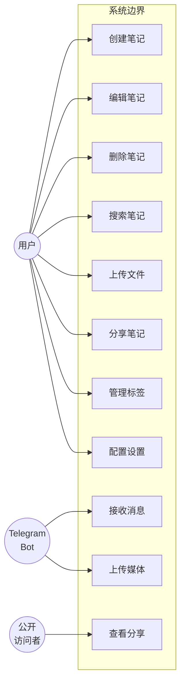

# 2. 需求分析

## 2.1 系统概述

Memos Worker 是一个功能强大、高性能的无服务器应用程序，用于笔记和知识管理。该系统完全基于 Cloudflare 生态系统构建，提供了一个私有的、经济高效的笔记解决方案。

本系统旨在为个人用户提供一个私有、高效的知识管理平台。系统基于 Cloudflare Workers、Pages、D1、R2 和 KV 技术栈构建，支持 Web 端访问。

## 2.2 功能需求

### 2.2.1 笔记管理模块

**需求来源**：代码实现 [src/index.js](../memos-worker/src/index.js)

| 需求编号 | 需求描述 | 优先级 | 实现状态 |
|---------|---------|--------|---------|
| FR-001  | 创建笔记，支持 Markdown 内容 | 高 | 已实现 |
| FR-002  | 编辑和更新笔记内容 | 高 | 已实现 |
| FR-003  | 删除笔记 | 高 | 已实现 |
| FR-004  | 笔记列表分页显示 | 高 | 已实现 |
| FR-005  | 笔记置顶功能 | 中 | 已实现 |
| FR-006  | 笔记收藏功能 | 中 | 已实现 |
| FR-007  | 笔记归档功能 | 中 | 已实现 |
| FR-008  | 笔记合并功能 | 低 | 已实现 |

**功能说明**：
- **FR-001 创建笔记**：[文件路径：../memos-worker/src/index.js，第 483-616 行] 实现了创建笔记的逻辑，支持 Markdown 内容和附件上传，自动提取标签和图片 URL。
- **FR-004 笔记列表分页**：[文件路径：../memos-worker/src/index.js，第 1 行] 定义了每页显示的笔记数量（NOTES_PER_PAGE = 10）。

### 2.2.2 文件与附件模块

**需求来源**：代码实现 [src/index.js](../memos-worker/src/index.js)

| 需求编号 | 需求描述 | 优先级 | 实现状态 |
|---------|---------|--------|---------|
| FR-101  | 图片上传与管理（R2/Imgur） | 高 | 已实现 |
| FR-102  | 文件附件上传 | 中 | 已实现 |
| FR-103  | 图片/文件删除 | 中 | 已实现 |
| FR-104  | 独立图片上传（粘贴支持） | 中 | 已实现 |

**功能说明**：
- **FR-101 图片上传**：[文件路径：../memos-worker/src/index.js，第 1259-1286 行] 实现了独立图片上传功能，图片存储在 R2 存储桶的 uploads 目录下。

### 2.2.3 标签与分类模块

**需求来源**：代码实现 [src/index.js](../memos-worker/src/index.js)

| 需求编号 | 需求描述 | 优先级 | 实现状态 |
|---------|---------|--------|---------|
| FR-201  | 自动从笔记内容提取标签 | 高 | 已实现 |
| FR-202  | 标签列表展示 | 中 | 已实现 |
| FR-203  | 按标签筛选笔记 | 中 | 已实现 |

**功能说明**：
- **FR-201 自动标签提取**：[文件路径：../memos-worker/src/index.js，第 1213-1254 行] 实现了智能标签提取功能，过滤掉 URL 中的 # 符号，只提取文本内容中的标签。

### 2.2.4 搜索与查询模块

**需求来源**：代码实现 [src/index.js](../memos-worker/src/index.js)

| 需求编号 | 需求描述 | 优先级 | 实现状态 |
|---------|---------|--------|---------|
| FR-301  | 全文搜索笔记内容 | 高 | 已实现 |
| FR-302  | 时间线视图 | 中 | 已实现 |
| FR-303  | 统计信息展示 | 低 | 已实现 |

**功能说明**：
- **FR-301 全文搜索**：[文件路径：../memos-worker/src/index.js，第 267-344 行] 使用 D1 FTS5 虚拟表实现全文搜索，支持标签筛选和时间范围筛选。

### 2.2.5 分享与公开访问模块

**需求来源**：代码实现 [src/index.js](../memos-worker/src/index.js)

| 需求编号 | 需求描述 | 优先级 | 实现状态 |
|---------|---------|--------|---------|
| FR-401  | 笔记公开分享链接生成 | 中 | 已实现 |
| FR-402  | 文件公开分享链接 | 中 | 已实现 |
| FR-403  | 取消分享功能 | 低 | 已实现 |

### 2.2.6 Telegram 集成模块

**需求来源**：代码实现 [src/index.js](../memos-worker/src/index.js)

| 需求编号 | 需求描述 | 优先级 | 实现状态 |
|---------|---------|--------|---------|
| FR-501  | Telegram Bot 接收消息 | 中 | 已实现 |
| FR-502  | Telegram 图片/视频上传 | 中 | 已实现 |
| FR-503  | Telegram 消息格式转换为 Markdown | 中 | 已实现 |
| FR-504  | Telegram 媒体代理模式 | 低 | 已实现 |

**功能说明**：
- **FR-503 Markdown 转换**：[文件路径：../memos-worker/src/index.js，第 834-920 行] 实现了 Telegram 实体（加粗、斜体、下划线、链接等）到 Markdown 格式的智能转换。

### 2.2.7 知识库（Docs）模块

**需求来源**：代码实现 [src/index.js](../memos-worker/src/index.js)

| 需求编号 | 需求描述 | 优先级 | 实现状态 |
|---------|---------|--------|---------|
| FR-601  | 树状结构文档管理 | 中 | 已实现 |
| FR-602  | 文档节点创建/编辑/删除 | 中 | 已实现 |
| FR-603  | 文档节点移动与重命名 | 低 | 已实现 |

### 2.2.8 认证与安全模块

**需求来源**：代码实现 [src/index.js](../memos-worker/src/index.js)

| 需求编号 | 需求描述 | 优先级 | 实现状态 |
|---------|---------|--------|---------|
| FR-701  | 用户登录认证 | 高 | 已实现 |
| FR-702  | 会话管理（30 天有效期） | 高 | 已实现 |
| FR-703  | 用户登出 | 中 | 已实现 |
| FR-704  | Telegram Webhook 安全验证 | 中 | 已实现 |

**功能说明**：
- **FR-701 登录认证**：[文件路径：../memos-worker/src/index.js，第 390-407 行] 实现了基于环境变量的用户名密码验证，会话存储在 KV 中。

### 2.2.9 设置与配置模块

**需求来源**：代码实现 [src/index.js](../memos-worker/src/index.js)

| 需求编号 | 需求描述 | 优先级 | 实现状态 |
|---------|---------|--------|---------|
| FR-801  | 用户设置保存与读取 | 中 | 已实现 |
| FR-802  | 主题/外观自定义 | 低 | 已实现 |
| FR-803  | 功能开关配置 | 低 | 已实现 |

## 2.3 非功能需求

### 2.3.1 性能需求

- **响应时间**：所有 API 接口响应时间由 Cloudflare 全球网络保证，通常在几十毫秒级别
- **并发支持**：无服务器架构自动弹性扩展，支持高并发访问
- **缓存策略**：
  - 静态文件：由 Cloudflare Pages CDN 缓存
  - 图片文件：[文件路径：../memos-worker/src/index.js，第 799 行] 设置了 1 天缓存
  - 独立上传图片：[文件路径：../memos-worker/src/index.js，第 1408 行] 设置了 1 年缓存

### 2.3.2 安全需求

- **身份认证**：[文件路径：../memos-worker/src/index.js，第 67-71 行] 中间件对所有受保护路由进行会话校验
- **数据安全**：
  - 所有数据存储在用户自己的 Cloudflare 账户中
  - Telegram Webhook 使用 secret token 验证（[文件路径：../memos-worker/src/index.js，第 971-973 行]）
  - 会话 Cookie 配置 HttpOnly、Secure、SameSite=Strict 属性
- **SQL 注入防护**：使用 D1 预编译语句（prepared statements）参数化查询

### 2.3.3 可用性需求

- 系统提供 Web 端访问，兼容主流浏览器
- 基于 Cloudflare 全球边缘网络，高可用性保证
- 支持自定义主题、背景等个性化设置

## 2.4 用例图

## 2.5 需求优先级汇总

按 MoSCoW 方法分类：

**Must Have（必须实现）**：
- 笔记创建、编辑、删除
- 用户登录认证
- Markdown 编辑支持
- 标签自动提取
- 全文搜索

**Should Have（应该实现）**：
- 笔记置顶/收藏/归档
- 图片/文件上传
- 笔记分享
- Telegram 集成

**Could Have（可以实现）**：
- 树状知识库
- 热力图
- 时间线视图
- 附件管理中心

**Won't Have（本期不实现）**：
- 多用户支持
- 协作编辑
- 评论功能
