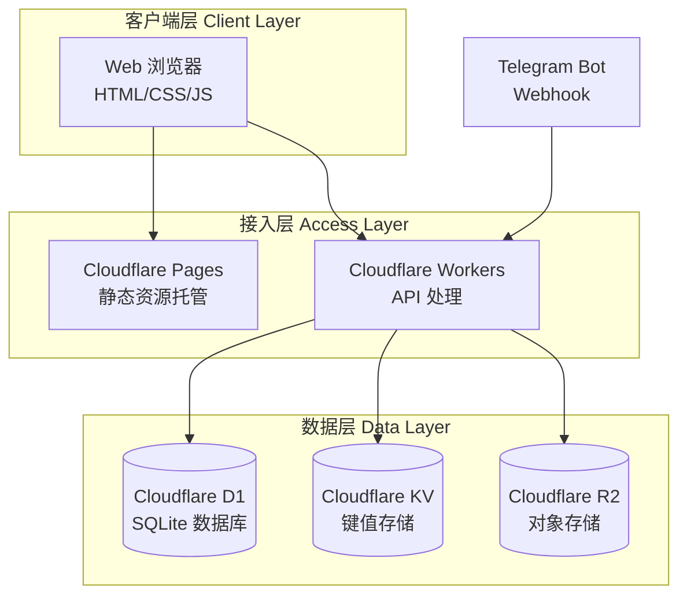
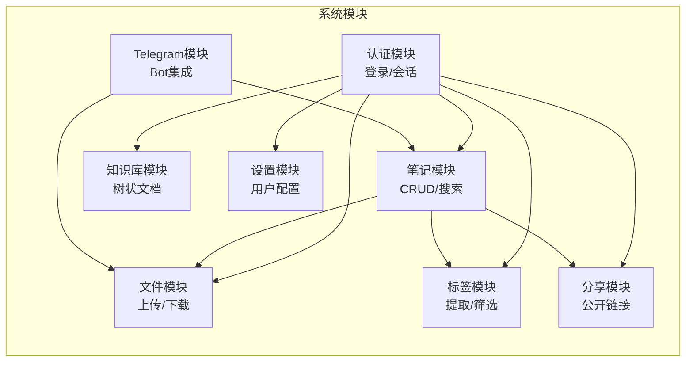
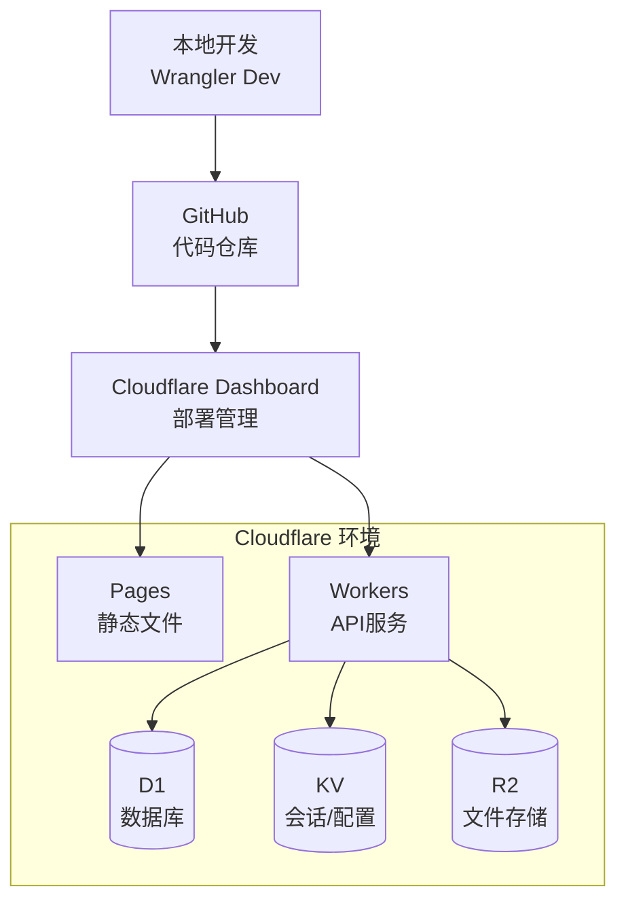

# 3. 系统架构设计

## 3.1 整体架构

本系统采用无服务器（Serverless）前后端分离架构，完全构建于 Cloudflare 生态系统之上。选择该架构的原因是：
- 无需管理服务器基础设施，降低运维成本
- 自动弹性扩展，根据流量自动调整资源
- 全球边缘网络部署，提供极低的访问延迟
- 免费套餐即可满足个人使用需求

### 架构分层

**层次说明**：

| 层次 | 职责 | 对应代码路径 |
|------|------|------------|
| 客户端层 | 用户交互界面，负责数据展示与用户操作 | [src/public/](../memos-worker/src/public/) |
| 接入层 | HTTP 请求路由处理、API 业务逻辑 | [src/index.js](../memos-worker/src/index.js) |
| 数据层 | 数据持久化、缓存、文件存储 | D1/KV/R2 |

## 3.2 技术选型

### 前端技术栈

| 技术 | 版本 | 选型理由 |
|------|------|---------|
| HTML5/CSS3/JavaScript | ES6+ | 原生 Web 技术，无需框架依赖，加载速度快 |
| Markdown 渲染器 | - | 支持实时预览和分屏编辑 |

**依据**：[文件路径：../memos-worker/src/public/](../memos-worker/src/public/) 目录下的静态文件实现了完整的前端界面。

### 后端技术栈

| 技术 | 版本 | 选型理由 |
|------|------|---------|
| Cloudflare Workers | - | 无服务器执行环境，边缘计算，极低延迟 |
| JavaScript/ES Modules | - | 与 Cloudflare Workers 原生兼容 |

**依据**：[文件路径：../memos-worker/package.json](../memos-worker/package.json) 定义了项目依赖。

### 数据存储选型

| 存储类型 | 选型 | 用途 | 选型理由 |
|---------|------|------|---------|
| 关系型数据库 | Cloudflare D1 | 笔记、标签、文档节点等结构化数据 | SQLite 兼容，与 Workers 深度集成 |
| 键值存储 | Cloudflare KV | 会话管理、用户设置 | 低延迟读取，适合缓存和配置数据 |
| 对象存储 | Cloudflare R2 | 图片、文件、附件 | 无出口费用，与 Workers 原生集成 |

## 3.3 模块划分

### 模块职责说明

**认证模块**（[src/index.js](../memos-worker/src/index.js) 第 390-423 行）
- 负责：用户登录验证、会话管理、登出处理
- 对外接口：`POST /api/login`、`POST /api/logout`
- 依赖：KV 存储（会话存储）

**笔记模块**（[src/index.js](../memos-worker/src/index.js) 第 483-759 行）
- 负责：笔记的增删改查、搜索、分页、置顶/收藏/归档
- 对外接口：`GET /api/notes`、`POST /api/notes`、`GET /api/notes/:id`、`PUT /api/notes/:id`、`DELETE /api/notes/:id`
- 依赖：D1 数据库、R2 存储、标签模块

**文件模块**（[src/index.js](../memos-worker/src/index.js) 第 765-1411 行）
- 负责：文件上传、下载、删除、独立图片上传、Imgur 代理
- 对外接口：`POST /api/upload/image`、`GET /api/images/:id`、`GET /api/files/:noteId/:fileId`、`POST /api/proxy/upload/imgur`
- 依赖：R2 存储

**标签模块**（[src/index.js](../memos-worker/src/index.js) 第 349-368 行）
- 负责：标签自动提取、标签列表、按标签筛选
- 对外接口：`GET /api/tags`
- 依赖：D1 数据库

**分享模块**（[src/index.js](../memos-worker/src/index.js) 第 16-51 行）
- 负责：笔记/文件分享链接生成、公开访问
- 对外接口：`GET /share/:id`、`GET /api/public/note/:id`、`GET /api/public/file/:id`
- 依赖：D1 数据库、R2 存储

**Telegram 模块**（[src/index.js](../memos-worker/src/index.js) 第 926-1189 行）
- 负责：Telegram Bot Webhook 处理、消息转 Markdown、媒体上传
- 对外接口：`POST /api/telegram_webhook/:secret`、`GET /api/tg-media-proxy/:fileId`
- 依赖：Telegram API、D1 数据库、R2 存储

**知识库模块**（[src/index.js](../memos-worker/src/index.js) 第 93-126 行）
- 负责：树状文档管理、节点 CRUD、移动/重命名
- 对外接口：`GET /api/docs/tree`、`POST /api/docs/node`、`GET /api/docs/node/:id`、`PUT /api/docs/node/:id`、`DELETE /api/docs/node/:id`、`PATCH /api/docs/node/:id`
- 依赖：D1 数据库

**设置模块**（[src/index.js](../memos-worker/src/index.js) 第 428-478 行）
- 负责：用户设置读取和保存
- 对外接口：`GET /api/settings`、`PUT /api/settings`
- 依赖：KV 存储

## 3.4 核心设计决策

### 决策 1：选择无服务器架构而非传统服务器

**背景**：个人笔记应用流量波动大，大部分时间访问量低，但需要保证可用性和低延迟。

**决策**：采用 Cloudflare Workers 无服务器架构。

**理由**：
- 按使用量付费，免费套餐即可满足需求，成本极低
- 全球边缘网络部署，用户就近访问，延迟低
- 无需运维服务器，专注业务逻辑开发
- 自动扩展，无需担心流量峰值

**影响**：[文件路径：../memos-worker/src/index.js](../memos-worker/src/index.js) 所有代码都符合 Workers 运行时规范。

### 决策 2：使用 D1 SQLite 而非其他数据库

**背景**：需要关系型数据库存储笔记、标签等结构化数据，且需要全文搜索能力。

**决策**：使用 Cloudflare D1（SQLite）。

**理由**：
- 与 Workers 深度集成，调用延迟低
- SQLite 足够轻量，适合个人应用规模
- 内置 FTS5 支持全文搜索
- 免费额度充足

**影响**：[文件路径：../memos-worker/src/schema.sql](../memos-worker/src/schema.sql) 定义了完整的数据库结构，包括 FTS5 虚拟表。

### 决策 3：使用 KV 存储会话而非数据库

**背景**：会话数据需要快速读取，且数据量小。

**决策**：使用 Cloudflare KV 存储会话信息。

**理由**：
- KV 读延迟极低，适合频繁读取的会话数据
- 会话数据非核心业务，丢失影响可控
- 支持自动过期（TTL）

**影响**：[文件路径：../memos-worker/src/index.js](../memos-worker/src/index.js) 第 373-385 行使用 KV 进行会话验证。

## 3.5 部署架构

**部署配置依据**：
- Wrangler 配置：[文件路径：../memos-worker/wrangler.toml](../memos-worker/wrangler.toml)
- 数据库 Schema：[文件路径：../memos-worker/src/schema.sql](../memos-worker/src/schema.sql)
- 部署脚本：[文件路径：../memos-worker/package.json](../memos-worker/package.json)
