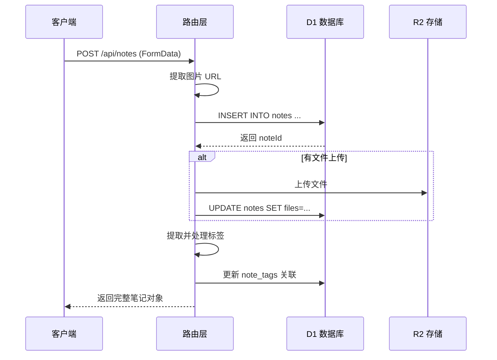
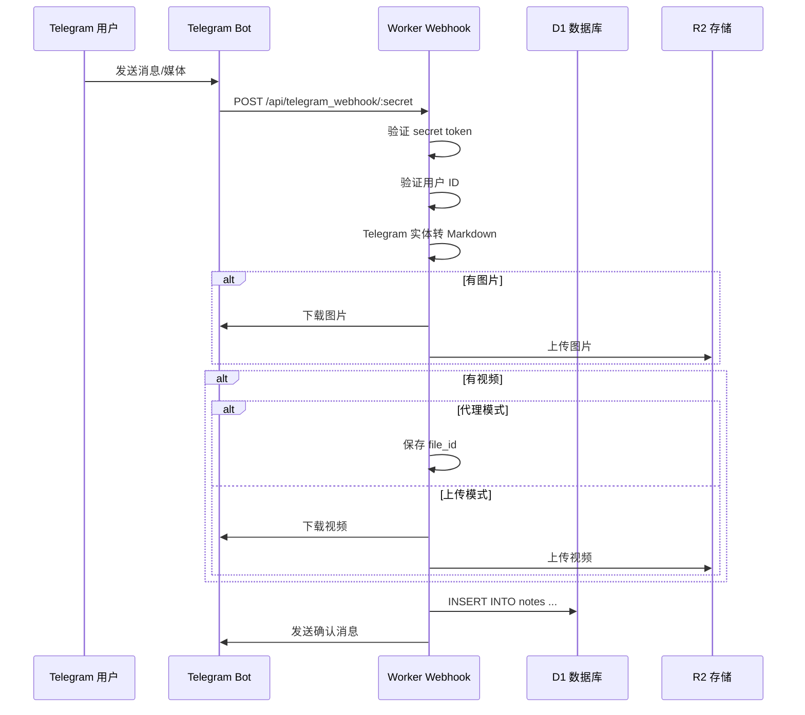

# 4. 系统功能实现

## 4.1 笔记管理模块实现

### 模块概述

笔记管理模块是系统的核心模块，负责笔记的增删改查、分页显示、置顶/收藏/归档等功能。

**核心文件**：
- [文件路径：../memos-worker/src/index.js](../memos-worker/src/index.js) - 完整实现

### 核心流程



### 关键代码说明

#### 创建笔记

**来源**：[文件路径：../memos-worker/src/index.js](../memos-worker/src/index.js)，第 483-616 行

```javascript
// 创建笔记的核心逻辑
const insertStmt = db.prepare(
  "INSERT INTO notes (content, files, is_pinned, created_at, updated_at, pics) VALUES (?, ?, 0, ?, ?, ?) RETURNING id"
);
const { id: noteId } = await insertStmt.bind(content, "[]", now, now, picUrls).first();

// 处理文件上传（非图片类型）
for (const file of files) {
  if (file.name && file.size > 0 && !file.type.startsWith('image/')) {
    const fileId = crypto.randomUUID();
    await env.NOTES_R2_BUCKET.put(`${noteId}/${fileId}`, file.stream());
    filesMeta.push({ id: fileId, name: file.name, size: file.size, type: file.type });
  }
}

// 处理标签
await processNoteTags(db, noteId, content);
```

**说明**：
- 创建笔记时先提取内容中的图片 URL 存入 pics 字段
- 只有非图片类型文件才作为附件存入 files 字段和 R2
- 使用 `processNoteTags` 函数自动提取和关联标签

#### 更新笔记

**来源**：[文件路径：../memos-worker/src/index.js](../memos-worker/src/index.js)，第 621-718 行

**说明**：
- 支持 `update_timestamp` 参数控制是否更新时间戳
- 删除文件时同步从 R2 删除
- 如果内容和附件都为空，自动删除整个笔记

#### 删除笔记

**来源**：[文件路径：../memos-worker/src/index.js](../memos-worker/src/index.js)，第 720-759 行

**说明**：
- 删除笔记前先收集所有相关文件的 R2 Key
- 批量从 R2 删除文件
- 删除数据库记录（由于外键 CASCADE，关联的 note_tags 会自动删除）

### 模块间交互

笔记模块与其他模块的交互：
- 依赖标签模块：调用 `processNoteTags` 自动提取标签
- 依赖文件模块：上传/删除附件文件
- 依赖分享模块：管理笔记的分享链接

## 4.2 标签处理模块实现

### 模块概述

标签处理模块负责从笔记内容中自动提取标签，管理标签列表，并支持按标签筛选笔记。

### 关键代码说明

#### 标签提取算法

**来源**：[文件路径：../memos-worker/src/index.js](../memos-worker/src/index.js)，第 1213-1254 行

```javascript
function processNoteTags(db, noteId, content) {
  const plainTextContent = content.replace(/<[^>]*>/g, '');
  
  // 定义两个正则表达式：一个用于标签，一个用于 URL
  const tagRegex = /#([\p{L}\p{N}_-]+)/gu;
  const urlRegex = /(https?:\/\/[^\s"']*[^\s"'.?,!])/g;
  
  // 将内容分割成"普通文本"和"链接文本"的交替数组
  const segments = plainTextContent.split(urlRegex);
  let allTags = [];
  
  // 只在【非链接】的文本片段中查找标签
  segments.forEach(segment => {
    if (!/^(https?:\/\/[^\s"']*[^\s"'.?,!])/.test(segment)) {
      const matchedInSegment = [...segment.matchAll(tagRegex)].map(match => match[1].toLowerCase());
      allTags.push(...matchedInSegment);
    }
  });
  
  // 去重
  const uniqueTags = [...new Set(allTags)];
  
  // 数据库操作...
}
```

**说明**：
- 使用两个正则表达式分离 URL 和标签
- 只在非 URL 片段中提取标签，避免误将 URL 中的 # 作为标签
- 标签统一转为小写存储

#### 标签列表查询

**来源**：[文件路径：../memos-worker/src/index.js](../memos-worker/src/index.js)，第 349-368 行

```javascript
const stmt = db.prepare(`
    SELECT t.name, COUNT(nt.note_id) as count
    FROM tags t
    LEFT JOIN note_tags nt ON t.id = nt.tag_id
    GROUP BY t.id, t.name
    HAVING count > 0
    ORDER BY count DESC, t.name ASC
`);
```

**说明**：
- 使用 LEFT JOIN 统计每个标签的使用次数
- 只返回被使用过的标签（HAVING count > 0）
- 按使用次数降序、名称升序排列

## 4.3 搜索模块实现

### 模块概述

搜索模块提供全文搜索功能，支持标签筛选、时间范围筛选等。

### 关键代码说明

#### 全文搜索

**来源**：[文件路径：../memos-worker/src/index.js](../memos-worker/src/index.js)，第 267-344 行

```javascript
const escapedQuery = query.replace(/"/g, '""');
let whereClauses = ["notes_fts MATCH ?"];
let bindings = [`"${escapedQuery}"*`];

// 支持多条件组合
if (isFavoritesMode) {
  whereClauses.push("n.is_favorited = 1");
}
if (startTimestamp && endTimestamp) {
  whereClauses.push("n.updated_at >= ? AND n.updated_at < ?");
  bindings.push(startTimestamp, endTimestamp);
}
if (tagName) {
  joinClause = `
    JOIN note_tags nt ON n.id = nt.note_id
    JOIN tags t ON nt.tag_id = t.id
  `;
  whereClauses.push("t.name = ?");
  bindings.push(tagName);
}
```

**说明**：
- 使用 FTS5 虚拟表进行全文搜索
- 搜索词用双引号包裹并加 * 后缀，实现前缀匹配
- 支持多个筛选条件的组合

## 4.4 Telegram 集成模块实现

### 模块概述

Telegram 集成模块允许用户通过 Telegram Bot 发送消息、图片、视频、文件来创建笔记。

### 核心流程



### 关键代码说明

#### Telegram 实体转 Markdown

**来源**：[文件路径：../memos-worker/src/index.js](../memos-worker/src/index.js)，第 834-920 行

```javascript
function telegramEntitiesToMarkdown(text, entities = []) {
  // 优先级决定了标签的嵌套顺序
  const tagPriority = {
    'text_link': 10,
    'bold': 20,
    'italic': 30,
    'underline': 40,
    'strikethrough': 50,
    'spoiler': 60,
    'code': 70,
    'pre': 80
  };
  
  // 构建修改数组
  const mods = Array.from({ length: text.length + 1 }, () => ({ openTags: [], closeTags: [] }));
  
  // 处理每个实体...
  
  // 应用修改生成最终 Markdown
}
```

**说明**：
- 根据优先级处理嵌套的格式实体
- 支持加粗、斜体、下划线、删除线、剧透、代码块、链接等格式
- 处理相邻标签的零宽度空格插入
- 特殊处理表情符号的加粗格式

## 4.5 认证与会话模块实现

### 模块概述

认证与会话模块负责用户登录验证和会话管理。

### 关键代码说明

#### 登录处理

**来源**：[文件路径：../memos-worker/src/index.js](../memos-worker/src/index.js)，第 390-407 行

```javascript
async function handleLogin(request, env) {
  const { username, password } = await request.json();
  if (username === env.USERNAME && password === env.PASSWORD) {
    const sessionId = crypto.randomUUID();
    const sessionData = { username, loggedInAt: Date.now() };
    await env.NOTES_KV.put(`session:${sessionId}`, JSON.stringify(sessionData), {
      expirationTtl: SESSION_DURATION_SECONDS, // 30 天
    });
    const headers = new Headers();
    headers.append('Set-Cookie', `${SESSION_COOKIE}=${sessionId}; HttpOnly; Secure; SameSite=Strict; Max-Age=${SESSION_DURATION_SECONDS}`);
    return jsonResponse({ success: true }, 200, headers);
  }
  return jsonResponse({ error: 'Invalid credentials' }, 401);
}
```

**说明**：
- 用户名密码存储在环境变量中
- 使用随机 UUID 作为会话 ID
- 会话存储在 KV 中，TTL 30 天
- Cookie 设置 HttpOnly、Secure、SameSite=Strict 属性

#### 会话验证

**来源**：[文件路径：../memos-worker/src/index.js](../memos-worker/src/index.js)，第 373-385 行

```javascript
async function isSessionAuthenticated(request, env) {
  const cookieHeader = request.headers.get('Cookie');
  if (!cookieHeader || !cookieHeader.includes(SESSION_COOKIE)) {
    return null;
  }
  const cookies = cookieHeader.split(';').map(c => c.trim());
  const sessionCookie = cookies.find(c => c.startsWith(`${SESSION_COOKIE}=`));
  if (!sessionCookie) return null;
  const sessionId = sessionCookie.split('=')[1];
  if (!sessionId) return null;
  const session = await env.NOTES_KV.get(`session:${sessionId}`, 'json');
  return session || null;
}
```

**说明**：
- 从 Cookie 中提取会话 ID
- 从 KV 中查询会话是否存在
- 作为中间件在所有受保护路由前调用
