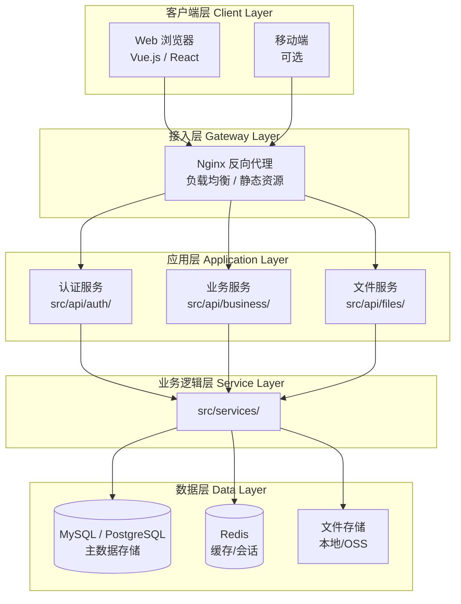
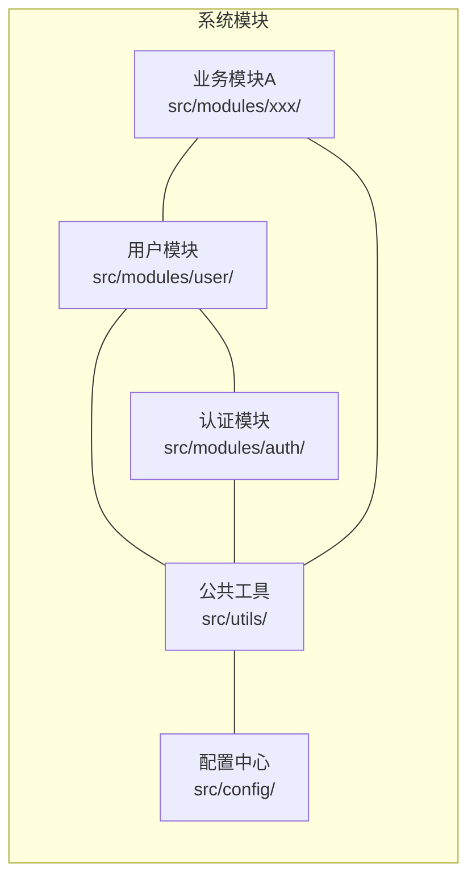
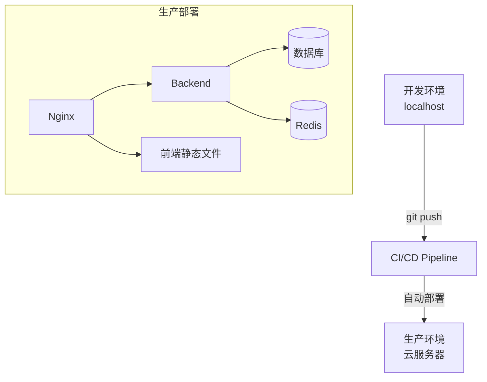

# 技术架构设计文档模板

用于论文第三章"系统设计"中的架构部分，展示技术选型合理性与系统整体结构。

---

## 模板结构

```markdown
# X.X 系统架构设计

## X.X.1 整体架构

本系统采用 [架构模式，如：前后端分离/微服务/MVC] 架构。
[说明选择该架构的原因，结合项目规模、团队情况、性能需求等]

### 架构分层



**层次说明：**

| 层次 | 职责 | 对应代码路径 |
|------|------|------------|
| 客户端层 | 用户交互界面，负责数据展示与用户操作 | `frontend/src/` |
| 接入层 | 请求路由、静态资源托管、SSL 终止 | `nginx/nginx.conf` |
| 应用层 | HTTP 请求处理、参数校验、权限控制 | `src/api/` |
| 业务逻辑层 | 核心业务规则、数据处理 | `src/services/` |
| 数据层 | 数据持久化、缓存、文件存储 | `src/models/` |

## X.X.2 技术选型

### 前端技术栈

| 技术 | 版本 | 选型理由 |
|------|------|---------|
| Vue.js / React | X.X | [说明选择理由，如生态成熟、团队熟悉等] |
| Axios | X.X | 基于 Promise 的 HTTP 客户端，支持请求拦截 |
| [UI框架] | X.X | [选型理由] |

**依据：** [文件路径: `frontend/package.json`] 中定义了完整的前端依赖关系。

### 后端技术栈

| 技术 | 版本 | 选型理由 |
|------|------|---------|
| [语言/框架] | X.X | [选型理由] |
| [ORM框架] | X.X | 对象关系映射，提升开发效率并防止SQL注入 |
| JWT | — | 无状态认证，便于水平扩展 |

**依据：** [文件路径: `requirements.txt` / `pom.xml` / `package.json`]

### 数据存储选型

| 存储类型 | 选型 | 用途 | 选型理由 |
|---------|------|------|---------|
| 关系型数据库 | MySQL 8.0 | 主数据存储 | 数据结构清晰、事务支持完善 |
| 缓存 | Redis 7.x | 会话/热点数据 | 高性能内存存储，支持多种数据结构 |

## X.X.3 模块划分



### 模块职责说明

**用户模块** （`src/modules/user/`）
- 负责：用户信息的增删改查
- 对外接口：`UserService` 类，提供 `get_user`、`update_profile` 等方法
- 依赖：认证模块、数据库连接

[为每个主要模块重复上述说明]

## X.X.4 核心设计决策

### 决策1：[如 选择RESTful而非GraphQL]

**背景：** [为什么需要做这个选择]

**决策：** 采用 RESTful API 设计风格

**理由：**
- 客户端需求相对固定，无需 GraphQL 的按需查询灵活性
- 团队对 REST 更为熟悉，学习成本低
- HTTP 缓存机制可直接复用

**影响：** [文件路径: `src/api/routes/`] 目录下所有路由遵循 RESTful 命名规范

### 决策2：[如 JWT vs Session]

[重复上述结构]

## X.X.5 部署架构



**部署配置依据：**
- Docker 配置：[文件路径: `docker-compose.yml`]
- 环境变量：[文件路径: `.env.example`]
- 部署脚本：[文件路径: `scripts/deploy.sh`]
```

---

## 填写指引

1. **架构图中每个节点**都应标注对应代码目录路径
2. **技术选型表格**的"选型理由"不能只写"性能好"，要结合项目具体需求
3. **核心设计决策**至少写2个，体现对技术方案的思考深度
4. 如果项目没有明确分层，从代码目录结构推断，标注"[基于代码结构推断]"
