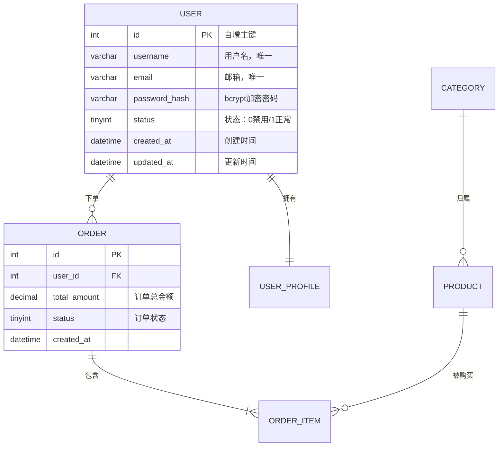

# 数据库设计文档模板

用于论文第三章"系统设计"中的数据库设计部分，从 ORM 模型或 SQL 文件逆向生成。

---

## 模板结构

```markdown
# X.X 数据库设计

## X.X.1 数据库概述

本系统使用 [数据库类型及版本] 作为主要数据存储，共设计 [N] 张数据表。
数据库命名为 `[db_name]`，字符集采用 `utf8mb4` 以支持完整的 Unicode 字符。

**数据模型来源：** [文件路径: `src/models/`] 目录下的 ORM 模型定义

## X.X.2 ER 图（实体关系图）



## X.X.3 数据表详细设计

### 表名：`users`（用户表）

**来源：** [文件路径: `src/models/user.py`，第 XX-XX 行]

| 字段名 | 数据类型 | 约束 | 默认值 | 说明 |
|-------|---------|------|--------|------|
| id | INT | PK, AUTO_INCREMENT | — | 用户唯一标识 |
| username | VARCHAR(50) | NOT NULL, UNIQUE | — | 登录用户名 |
| email | VARCHAR(100) | NOT NULL, UNIQUE | — | 电子邮箱 |
| password_hash | VARCHAR(255) | NOT NULL | — | bcrypt 加密后的密码 |
| status | TINYINT(1) | NOT NULL | 1 | 账号状态：0=禁用，1=正常 |
| created_at | DATETIME | NOT NULL | CURRENT_TIMESTAMP | 注册时间 |
| updated_at | DATETIME | NOT NULL | CURRENT_TIMESTAMP ON UPDATE | 最后修改时间 |

**索引设计：**
- 主键索引：`id`
- 唯一索引：`username`、`email`（防止重复注册）

**设计说明：**
密码字段存储 bcrypt 哈希值而非明文，加密逻辑位于 
[文件路径: `src/utils/security.py`，`hash_password()` 函数]。

---

### 表名：`[表名]`（[中文说明]）

**来源：** [文件路径: `src/models/xxx.py`，第 XX-XX 行]

[重复表格结构]

---

## X.X.4 数据库关系说明

### 一对一关系

| 主表 | 从表 | 关联字段 | 说明 |
|------|------|---------|------|
| users | user_profiles | users.id = user_profiles.user_id | 每个用户有唯一的详细资料 |

**代码实现：** [文件路径: `src/models/user.py`] 中通过 ORM relationship 定义关联：
```python
# 来源：src/models/user.py，第 XX 行
profile = relationship("UserProfile", back_populates="user", uselist=False)
```

### 一对多关系

| 主表 | 从表 | 关联字段 | 说明 |
|------|------|---------|------|
| users | orders | orders.user_id | 一个用户可下多个订单 |

### 多对多关系

| 表A | 中间表 | 表B | 说明 |
|-----|--------|-----|------|
| products | order_items | orders | 订单与商品的多对多关系 |

## X.X.5 数据库性能设计

### 索引策略

| 表名 | 索引名 | 索引列 | 索引类型 | 创建原因 |
|------|--------|--------|---------|---------|
| orders | idx_user_id | user_id | 普通索引 | 频繁按用户查询订单 |
| orders | idx_created_at | created_at | 普通索引 | 支持时间范围查询 |

**索引代码依据：** [文件路径: `migrations/xxxx_create_orders.py`]

### 其他优化措施
- 使用数据库连接池（最大连接数：[config值]），配置见 [文件路径: `src/config/database.py`]
- 对查询频繁的热点数据，在 Redis 中设置缓存（TTL：[N]秒），逻辑见 [文件路径: `src/services/cache_service.py`]
```

---

## 填写指引

1. **ER图**节点中的字段尽量写完整（至少写关键字段）
2. **来源**字段必填，标注到具体的模型文件和行号
3. 如果用的是迁移文件（migrations），也要引用迁移文件路径
4. **索引策略**一定要说明"为什么建这个索引"，不能只列出索引
5. 字段说明里的枚举值（如status=0/1）要完整列出含义
