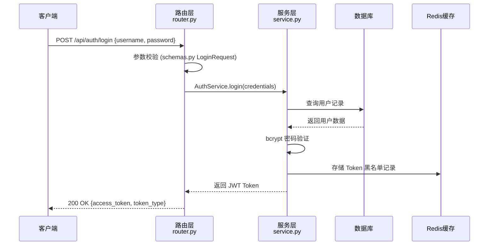

# 模块详细设计文档模板

用于论文第四章"系统实现"，对每个核心功能模块进行代码级说明。

---

## 模板结构

```markdown
# X.X 系统功能实现

## X.X.1 [模块名称，如：用户认证模块]实现

### 模块概述

[2-3句话描述该模块的职责范围和在系统中的位置]

**核心文件：**
- [文件路径: `src/modules/auth/__init__.py`] — 模块入口
- [文件路径: `src/modules/auth/service.py`] — 业务逻辑
- [文件路径: `src/modules/auth/router.py`] — 路由定义
- [文件路径: `src/modules/auth/schemas.py`] — 数据校验模型

### 核心流程



### 关键代码说明

#### [关键函数/类 1]

**来源：** [文件路径: `src/modules/auth/service.py`，第 45-78 行]

```python
# 来源：src/modules/auth/service.py，第 45-78 行
class AuthService:
    def authenticate_user(self, username: str, password: str) -> Optional[User]:
        """
        验证用户凭据，成功返回 User 对象，失败返回 None
        使用 bcrypt 进行密码哈希比对，避免时序攻击
        """
        user = self.db.query(User).filter(User.username == username).first()
        if not user or not verify_password(password, user.password_hash):
            return None
        return user
```

**说明：**
- 采用常量时间比较（`hmac.compare_digest`）防止时序攻击
- 查询失败和密码错误返回相同错误信息，防止用户名枚举攻击

#### [关键函数/类 2]

[重复上述结构]

### 模块间交互

[文件路径: `src/modules/auth/dependencies.py`] 定义了认证依赖项，
供其他模块通过 FastAPI 依赖注入复用：

```python
# 来源：src/modules/auth/dependencies.py，第 12-28 行
async def get_current_user(token: str = Depends(oauth2_scheme)) -> User:
    ...
```

其他模块（如 `src/modules/order/router.py`）通过 `Depends(get_current_user)` 
注入此依赖，实现统一的权限控制。

---

## X.X.2 [下一个模块]实现

[重复上述结构]
```

---

# API 接口文档模板

用于论文附录或第三章，展示系统对外提供的接口规范。

---

## 模板结构

```markdown
# 附录X：API 接口文档

## 接口规范说明

**基础路径：** `http://[domain]/api/v1`
**认证方式：** Bearer Token（JWT），在请求头中携带：`Authorization: Bearer <token>`
**数据格式：** 请求体和响应体均使用 JSON 格式
**字符编码：** UTF-8

**统一响应格式：**
```json
{
  "code": 200,        // 业务状态码，200=成功
  "message": "ok",   // 状态描述
  "data": {}         // 响应数据，失败时为 null
}
```

**来源：** [文件路径: `src/schemas/response.py`] 中的 `BaseResponse` 类定义

---

## 用户认证接口

### POST /auth/login — 用户登录

**来源：** [文件路径: `src/api/auth/router.py`，第 XX 行]

**请求参数：**

| 参数名 | 位置 | 类型 | 必填 | 说明 |
|-------|------|------|------|------|
| username | Body | string | 是 | 用户名，长度 4-20 位 |
| password | Body | string | 是 | 密码，长度 8-20 位 |

**请求示例：**
```json
POST /api/v1/auth/login
Content-Type: application/json

{
  "username": "testuser",
  "password": "password123"
}
```

**响应示例（成功）：**
```json
{
  "code": 200,
  "message": "登录成功",
  "data": {
    "access_token": "eyJhbGciOiJIUzI1...",
    "token_type": "bearer",
    "expires_in": 86400
  }
}
```

**响应示例（失败）：**
```json
{
  "code": 401,
  "message": "用户名或密码错误",
  "data": null
}
```

**错误码说明：**

| 错误码 | 含义 |
|-------|------|
| 200 | 成功 |
| 400 | 请求参数错误 |
| 401 | 认证失败 |
| 403 | 权限不足 |
| 404 | 资源不存在 |
| 500 | 服务器内部错误 |

---

### [下一个接口]

[重复上述结构]
```

---

## 填写指引

### 模块设计
1. **关键代码说明**：每个核心函数都要有"为什么这样设计"的解释
2. **流程图**：用 sequenceDiagram 展示跨模块的调用链
3. 说明模块是否使用了设计模式（如工厂模式、观察者模式），并解释原因

### API 文档
1. 每个接口必须有**完整的请求/响应示例**（JSON格式）
2. 错误情况也要举例，不只写成功情况
3. 标注接口需要哪种权限（无需认证/普通用户/管理员）
