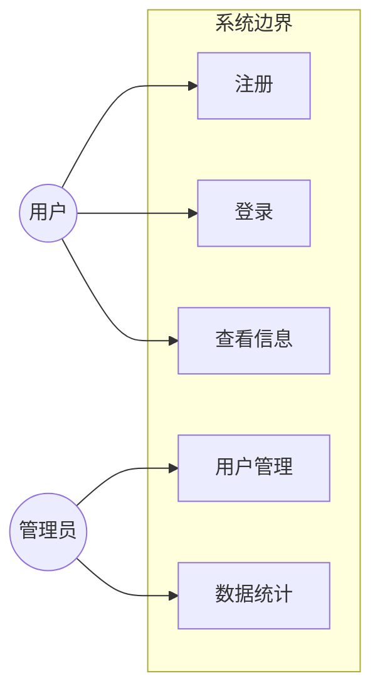

# 需求分析文档模板

用于论文第二章"需求分析"，从对话历史与代码逆向整理功能需求。

---

## 模板结构

```markdown
# X.X 需求分析

## X.X.1 系统概述

[2-3句话描述系统整体目标和面向的用户群体]

本系统旨在为 [目标用户] 提供 [核心价值]。系统基于 [技术栈] 构建，
支持 [主要平台/终端]。

## X.X.2 功能需求

### X.X.2.1 [模块名称，如：用户管理模块]

**需求来源：** [对话记录推断 / 代码实现 `src/xxx/xxx.py`]

| 需求编号 | 需求描述 | 优先级 | 实现状态 |
|---------|---------|--------|---------|
| FR-001  | 用户注册功能，支持邮箱验证 | 高 | 已实现 |
| FR-002  | 用户登录，采用 JWT 无状态认证 | 高 | 已实现 |
| FR-003  | 忘记密码，通过邮件找回 | 中 | 已实现 |

**功能说明：**
- **FR-001 用户注册**：[文件路径: `src/api/auth.py`, 第 XX-XX 行] 实现了注册逻辑，
  包括邮箱格式校验、密码强度检测和邮件验证码发送三个环节。
  
- **FR-002 用户登录**：[文件路径: `src/api/auth.py`, 第 XX-XX 行] 采用 JWT 
  (JSON Web Token) 实现无状态认证，Token 有效期为 24 小时。

### X.X.2.2 [下一个模块]

[重复上述结构]

## X.X.3 非功能需求

### 性能需求
- **响应时间**：API 接口平均响应时间不超过 200ms
  - 依据：[文件路径: `config/settings.py`] 中配置的超时参数
- **并发支持**：系统支持不少于 XX 个并发用户
  - 依据：[文件路径: `src/server.py`] 中的 worker 配置

### 安全需求
- **身份认证**：[文件路径: `src/middleware/auth.py`] 中间件对所有受保护路由进行 Token 校验
- **数据加密**：用户密码采用 bcrypt 算法加密存储（见 `src/utils/security.py`）
- **SQL注入防护**：使用 ORM 框架参数化查询，杜绝注入风险

### 可用性需求
- 系统提供 Web 端访问，兼容主流浏览器（Chrome、Firefox、Edge）
- 响应式布局，支持移动端访问
  - 依据：[文件路径: `frontend/src/styles/responsive.css`]

## X.X.4 用例图



## X.X.5 需求优先级汇总

按 MoSCoW 方法分类：

**Must Have（必须实现）：**
- [列举核心功能]

**Should Have（应该实现）：**
- [列举重要但非核心功能]

**Could Have（可以实现）：**
- [列举锦上添花功能]

**Won't Have（本期不实现）：**
- [列举明确排除的功能，及原因]
```

---

## 填写指引

1. **从对话中提取需求时**，在括号内注明"对话记录第X轮推断"
2. **从代码中逆向需求时**，直接引用文件路径（必填）
3. 优先级参考：登录注册=高，核心业务=高，辅助功能=中，统计分析=低
4. 表格中"实现状态"根据代码实际情况填写：已实现/部分实现/未实现
